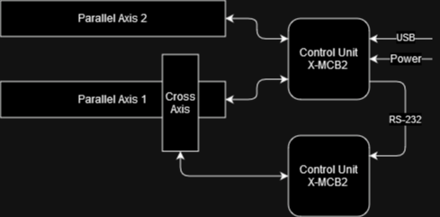

# Description

This project deploys an OPC-UA server for controlling the slide axes connected to a Zaber controller.
The server acts as middleware, translating messages from OPC-UA clients to the Zaber specific communication protocol.
It provides methods for controlling the axes and publishes measurement values.

## Hardware

The machine contains three axes: Two are placed in parallel and move together, while third is mounted perpendicular and can move independently.
The step motors for the parallel axes are connected a Zaber control unit, which is daisy-chained to a second control unit with the independent axis.
One control unit is further connected to a Raspberry Pi via USB, which is executing the OPC-UA server.



## Software

The OPC-UA server is written in Python and runs on a Raspberry Pi.

### Raspberry Pi

The Raspberry Pi is running Raspberry Pi OS Lite.
Its static IP address is `193.171.191.15`.
To connect via SSH, run:

```sh
ssh root@193.171.191.15
```

The source code for the OPC-UA server can be found in the directory `/zaber-opcua`.
The configuration of the server is done using environment variables.
The script `/run_zaber_opcua.sh` sets all environment variables and starts the server.

The OPC-UA server automatically restarts after reboots.
This is done via [crontab](https://wiki.archlinux.org/title/Cron).

TODO(marco): How to check server status

### OPC-UA Server

An OPC-UA server provides endpoints for other clients to connect to.
The endpoints are structured in a nested node tree.

The server provides two nodes:
- Parallel Slide
- Cross Slide

Each node contains the following methods to control the corresponding axis:
- `move_absolute`: Moves to the absolute position
- `move_relative`: Moves relative to the current position
- `move_velocity`: Moves the axis with the provided velocity
- `stop`: Stops the movement of the axis

Additionally, the following values are published for each node:
- `status`: An error description, or `Ok`
- `position`: The position of the slide
- `busy`: `true` if the axis is moving, else `false`

# Setup

## Device Access

The user running the OPC-UA server needs to have read/write access to the device file of the Zaber controller.

To find the correct device:

1. Disconnect the Zaber controller

2. Run `ls /dev`

3. Connect the Zaber controller

4. Run `ls /dev` again and check which device is new

Then, run the following command to grant read/write access to all users:

```sh
sudo chmod a+rw /dev/<device>
```

## OPC-UA Server

Install Python 3.9 with `pip` (higher versions might work as well)

1. Clone this repository to the directory `/zaber-opcua`

```sh
git clone https://github.com/xRetry/zaber-opcua /zaber-opcua
```

2. Install the required Python packages 

```sh
pip install -r /zaber-opcua/requirements.txt
```

3. Adjust the settings in `/zaber-opcua/src/zaber-opcua/settings.py` or change them via environment variables.

4. Start the OPC-UA server

```sh
python /zaber-opcua/src/zaber-opcua/main.py
```

If the server does not crash after starting, the setup should be ok.
To be sure, try to connect to the server using an OPC-UA client of your choice (e.g. [UaExpert](https://www.unified-automation.com/products/development-tools/uaexpert.html)).

## Automatic Restart

1. Create a shell script, which sets the environment variables and starts the server

```sh
cat > /run_zaber_opcua.sh << EOF
#!/bin/sh
export ZABER_SERIAL_PORT=/dev/ttyACM0
export OPCUA_REFRESH_RATE=0.1
export OPCUA_LOG_LEVEL=ERROR
python /zaber-opcua/src/zaber-opcua/main.py
EOF
```

2. Edit the crontab file

```sh
crontab -e
```

3. Add the following line to crontab:

```sh
@reboot sh /run_zaber_opcua.sh
```

4. Save and exit the text editor

